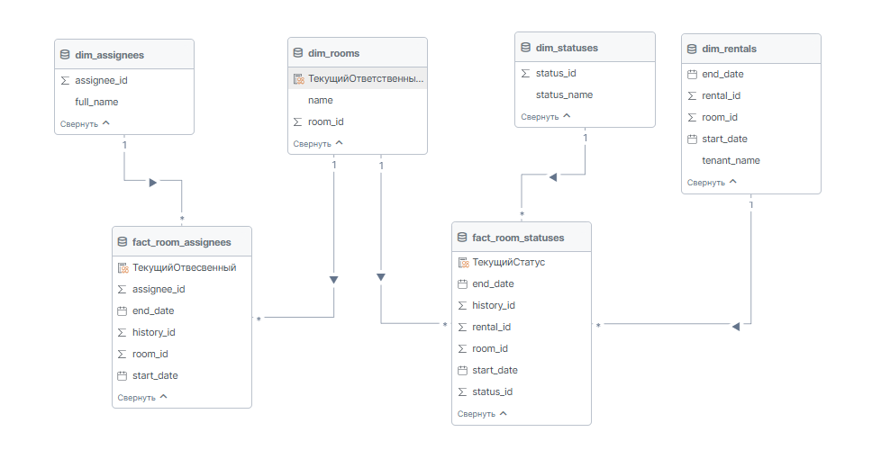

```markdown
# Документация DAX формулы: Текущий ответственный для активных помещений

## Метрика: `ТекущийОтветственныйДляАктивныхПомещений`

```dax
ТекущийОтветственныйДляАктивныхПомещений = 
MAXX(
    FILTER(
        dim_rooms,
        CALCULATE(COUNTROWS(fact_room_statuses)) > 0
    ),
    CALCULATE(
        MAXX(
            FILTER(
                fact_room_assignees,
                fact_room_assignees[start_date] = 
                    CALCULATE(MAX(fact_room_assignees[start_date]))
            ),
            RELATED(dim_assignees[full_name])
        )
    )
)
```

## Бизнес-назначение

Определяет **текущего ответственного сотрудника** для всех помещений, которые имеют активные статусы в системе.
Формула автоматически находит самого последнего назначенного ответственного для каждого "живого" помещения.

## Контекст модели данных

### Участвующие таблицы:
- **`dim_rooms`** - Таблица измерений (основные данные помещений)
- **`fact_room_statuses`** - Первая таблица фактов (история статусов помещений)
- **`fact_room_assignees`** - Вторая таблица фактов (история ответственных)
- **`dim_assignees`** - Таблица измерений (основные данные ответственных)

### Связи:
```
dim_rooms (1) → (Многие) fact_room_statuses
dim_rooms (1) → (Многие) fact_room_assignees  
```



## Пошаговое выполнение

### Шаг 1: Первичная фильтрация
```dax
FILTER(
    dim_rooms,
    CALCULATE(COUNTROWS(fact_room_statuses)) > 0
)
```
**Назначение**: Фильтрует помещения, оставляя только те, у которых есть записи статусов

### Шаг 2: Переход контекста
```dax
CALCULATE(MAXX(...))
```
**Назначение**: Переход от контекста строки к контексту фильтра для каждого помещения

### Шаг 3: Фильтрация по дате
```dax
FILTER(
    fact_room_assignees,
    fact_room_assignees[start_date] = 
        CALCULATE(MAX(fact_room_assignees[start_date]))
)
```
**Назначение**: Находит самую последнюю запись ответственного для помещения

### Шаг 4: Получение имени
```dax
MAXX(..., RELATED(dim_assignees[full_name]))
```
**Назначение**: Извлекает полное имя ответственного из таблицы измерений

## Ключевые концепции DAX

### 1. Межтабличная фильтрация
```dax
FILTER(dim_table, CALCULATE(COUNTROWS(fact_table1)) > 0)
```
**Применение**: Фильтрация измерений на основе существования в другой таблице ( фактов )

### 2. Переход контекста
- Контекст строки → Контекст фильтра с помощью `CALCULATE`
- Необходим для построчных вычислений с агрегациями

### 3. Функция RELATED
- Навигация от стороны "многие" к стороне "один" в связи
- Требует активной связи между таблицами

### 4. Шаблон MAX с FILTER
```dax
FILTER(table, table[date] = CALCULATE(MAX(table[date])))
```
**Применение**: Найти самую последнюю запись на основе поля даты


```dax
CurrentAssigneeForActiveRooms = 
MAXX(
    FILTER(
        fact_room_assignees,
        fact_room_assignees[assignee_id] = MAXX(
            dim_rooms,
            IF(
                ISBLANK(MAX(fact_room_statuses[room_id])),
                BLANK(),
                MAX(fact_room_assignees[assignee_id])
            )
        )
    ),
    RELATED(dim_assignees[full_name])
)
```

## REMOVEFILTERS


НЕ верно
```

CurrentStatus = MAXX(
    FILTER(
        fact_room_statuses,
        fact_room_statuses[start_date] = 
            CALCULATE(
                MAXX(fact_room_statuses, fact_room_statuses[start_date]),
                REMOVEFILTERS(dim_statuses)
            )
    ),
    RELATED(dim_statuses[status_name])
)
```


Верно
```

CurrentStatus = CALCULATE(
    MAXX(
        FILTER(
            fact_room_statuses,
            fact_room_statuses[start_date] = MAXX(fact_room_statuses, fact_room_statuses[start_date])
        ),
        RELATED(dim_statuses[status_name])
    ),
    REMOVEFILTERS(dim_statuses)
)

```


## Решение с сравнением статусов

```dax
MatchingStatus = 
VAR StatusWithFilter = MAXX(
    FILTER(
        fact_room_statuses,
        fact_room_statuses[start_date] = MAXX(fact_room_statuses, fact_room_statuses[start_date])
    ),
    RELATED(dim_statuses[status_name])
)
VAR StatusWithoutFilter = CALCULATE(
    MAXX(
        FILTER(
            fact_room_statuses,
            fact_room_statuses[start_date] = MAXX(fact_room_statuses, fact_room_statuses[start_date])
        ),
        RELATED(dim_statuses[status_name])
    ),
    REMOVEFILTERS(dim_statuses)
)
RETURN IF(StatusWithFilter = StatusWithoutFilter, StatusWithFilter, BLANK())

```


## Альтернатива без VAR (используя вложенные вычисления)


```dax

MatchingStatus = 
IF(
    MAXX(
        FILTER(
            fact_room_statuses,
            fact_room_statuses[start_date] = MAXX(fact_room_statuses, fact_room_statuses[start_date])
        ),
        RELATED(dim_statuses[status_name])
    ) = 
    CALCULATE(
        MAXX(
            FILTER(
                fact_room_statuses,
                fact_room_statuses[start_date] = MAXX(fact_room_statuses, fact_room_statuses[start_date])
            ),
            RELATED(dim_statuses[status_name])
        ),
        REMOVEFILTERS(dim_statuses)
    ),
    MAXX(
        FILTER(
            fact_room_statuses,
            fact_room_statuses[start_date] = MAXX(fact_room_statuses, fact_room_statuses[start_date])
        ),
        RELATED(dim_statuses[status_name])
    ),
    BLANK()
)


```

## Последий отвесвенный для максимального статуса из фильтра


```dax
CurrentAssigneeForMatchingStatus = 
MAXX(
    FILTER(
        dim_rooms,
        AND(
            CALCULATE(COUNTROWS(fact_room_statuses)) > 0,
            CALCULATE(
                MAXX(
                    FILTER(
                        fact_room_statuses,
                        fact_room_statuses[start_date] = MAXX(fact_room_statuses, fact_room_statuses[start_date])
                    ),
                    RELATED(dim_statuses[status_name])
                )
            ) = 
            CALCULATE(
                MAXX(
                    FILTER(
                        fact_room_statuses,
                        fact_room_statuses[start_date] = MAXX(fact_room_statuses, fact_room_statuses[start_date])
                    ),
                    RELATED(dim_statuses[status_name])
                ),
                REMOVEFILTERS(dim_statuses)
            )
        )
    ),
    CALCULATE(
        MAXX(
            FILTER(
                fact_room_assignees,
                fact_room_assignees[start_date] = 
                    CALCULATE(MAX(fact_room_assignees[start_date]))
            ),
            RELATED(dim_assignees[full_name])
        )
    )
)


```