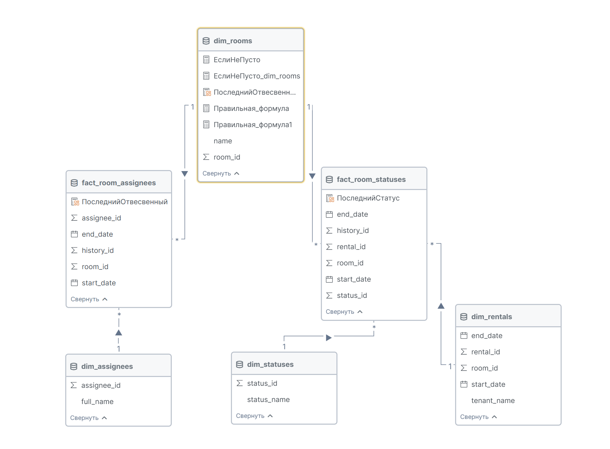

```markdown
# Документация DAX формулы: Текущий ответственный для активных помещений

## Метрика: `ТекущийОтветственныйДляАктивныхПомещений`

```dax
ТекущийОтветственныйДляАктивныхПомещений = 
MAXX(
    FILTER(
        dim_rooms,
        CALCULATE(COUNTROWS(fact_room_statuses)) > 0
    ),
    CALCULATE(
        MAXX(
            FILTER(
                fact_room_assignees,
                fact_room_assignees[start_date] = 
                    CALCULATE(MAX(fact_room_assignees[start_date]))
            ),
            RELATED(dim_assignees[full_name])
        )
    )
)
```

## Бизнес-назначение

Определяет **текущего ответственного сотрудника** для всех помещений, которые имеют активные статусы в системе.
Формула автоматически находит самого последнего назначенного ответственного для каждого "живого" помещения.

## Контекст модели данных

### Участвующие таблицы:
- **`dim_rooms`** - Таблица измерений (основные данные помещений)
- **`fact_room_statuses`** - Первая таблица фактов (история статусов помещений)
- **`fact_room_assignees`** - Вторая таблица фактов (история ответственных)
- **`dim_assignees`** - Таблица измерений (основные данные ответственных)

### Связи:
```
dim_rooms (1) → (Многие) fact_room_statuses
dim_rooms (1) → (Многие) fact_room_assignees  
```



## Пошаговое выполнение

### Шаг 1: Первичная фильтрация
```dax
FILTER(
    dim_rooms,
    CALCULATE(COUNTROWS(fact_room_statuses)) > 0
)
```
**Назначение**: Фильтрует помещения, оставляя только те, у которых есть записи статусов

### Шаг 2: Переход контекста
```dax
CALCULATE(MAXX(...))
```
**Назначение**: Переход от контекста строки к контексту фильтра для каждого помещения

### Шаг 3: Фильтрация по дате
```dax
FILTER(
    fact_room_assignees,
    fact_room_assignees[start_date] = 
        CALCULATE(MAX(fact_room_assignees[start_date]))
)
```
**Назначение**: Находит самую последнюю запись ответственного для помещения

### Шаг 4: Получение имени
```dax
MAXX(..., RELATED(dim_assignees[full_name]))
```
**Назначение**: Извлекает полное имя ответственного из таблицы измерений

## Ключевые концепции DAX

### 1. Межтабличная фильтрация
```dax
FILTER(dim_table, CALCULATE(COUNTROWS(fact_table1)) > 0)
```
**Применение**: Фильтрация измерений на основе существования в другой таблице фактов

### 2. Переход контекста
- Контекст строки → Контекст фильтра с помощью `CALCULATE`
- Необходим для построчных вычислений с агрегациями

### 3. Функция RELATED
- Навигация от стороны "многие" к стороне "один" в связи
- Требует активной связи между таблицами

### 4. Шаблон MAX с FILTER
```dax
FILTER(table, table[date] = CALCULATE(MAX(table[date])))
```
**Применение**: Найти самую последнюю запись на основе поля даты

## Альтернативные варианты

### Для нескольких последних записей:
```dax
CONCATENATEX(
    FILTER(
        dim_rooms,
        CALCULATE(COUNTROWS(fact_room_statuses)) > 0
    ),
    CALCULATE(
        MAXX(
            FILTER(
                fact_room_assignees,
                fact_room_assignees[start_date] = 
                    CALCULATE(MAX(fact_room_assignees[start_date]))
            ),
            RELATED(dim_assignees[full_name])
        )
    ),
    ", "
)
```

## Производные метрики

```dax
-- Количество активных помещений на ответственного
АктивныеПомещенияНаОтветственного = 
COUNTROWS(
    FILTER(
        SUMMARIZE(
            FILTER(dim_rooms, CALCULATE(COUNTROWS(fact_room_statuses)) > 0),
            dim_rooms[room_id],
            "Ответственный", [ТекущийОтветственныйДляАктивныхПомещений]
        ),
        [Ответственный] = SELECTEDVALUE(dim_assignees[full_name])
    )
)

-- Дата последнего назначения
ДатаПоследнегоНазначения = 
MAXX(
    FILTER(dim_rooms, CALCULATE(COUNTROWS(fact_room_statuses)) > 0),
    CALCULATE(MAX(fact_room_assignees[start_date]))
)
```

## Сценарии использования

1. **Ежедневный отчет** по ответственным за помещения с текущими проблемами
2. **Распределение нагрузки** между сотрудниками
3. **Мониторинг назначений** для аудита и контроля
4. **Автоматическое оповещение** при смене ответственных

## Рекомендации по производительности

- **Индексация**: Убедитесь, что столбцы `start_date` индексированы
- **Связи**: Проверьте активные связи между таблицами
- **Объем данных**: Рассмотрите использование итоговых таблиц для больших наборов данных

Метрика автоматически обновляется при добавлении новых статусов, изменении ответственных или обновлении дат назначения.
```