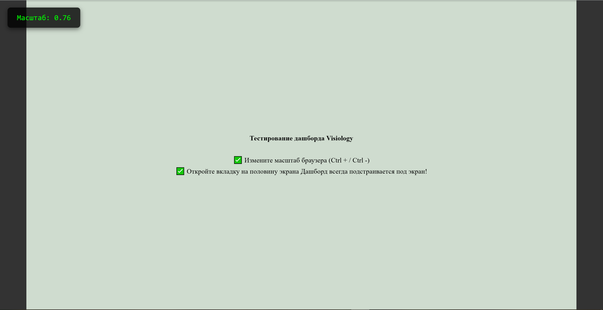

# DashboardViewport Simulator

Утилита для эмуляции поведения дашборда Visiology в фиксированном разрешении 1920x1080.
Позволяет разработчикам предварительно просмотреть, как кастомные элементы будут
масштабироваться и отображаться в реальной среде Visiology.

