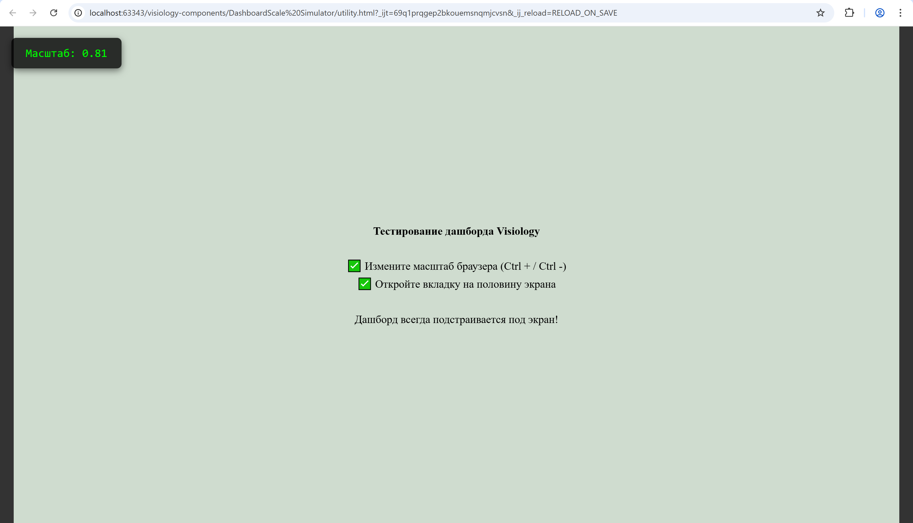

# DashboardViewport Simulator

Утилита для эмуляции поведения дашборда Visiology в фиксированном разрешении 1920x1080.
Позволяет разработчикам предварительно просмотреть, как кастомные элементы будут
масштабироваться и отображаться в реальной среде Visiology.

элемент в id `va-widgets-container` соответсвует поведению `object-fit: contain`.
Это достигается при помощи библиотеки Knockout.js.

