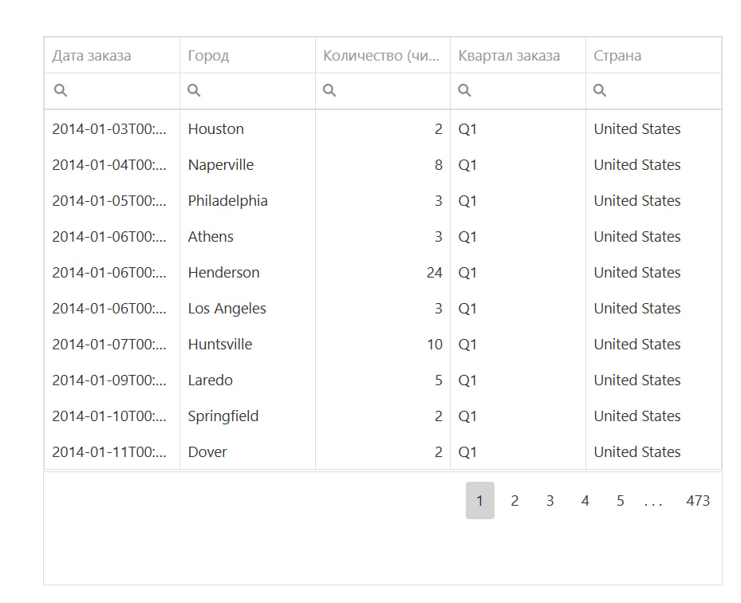

# DataGrid Widget for Visiology

Виджет-таблица на основе DevExtreme DataGrid.



```javascript

// Тестовые данные
// В реальном виджете данные будут браться из w.data
const data = [
    { id: 1, name: "Иван", age: 25, city: "Москва" },
    { id: 2, name: "Мария", age: 30, city: "Санкт-Петербург" },
    { id: 3, name: "Петр", age: 28, city: "Казань" }
];

// Создание таблицы
$("#" + w.general.renderTo).dxDataGrid({
    dataSource: data,
    columns: ["id", "name", "age", "city"],
});

```
📚 [Официальная документация](https://js.devexpress.com/jQuery/Demos/WidgetsGallery/Demo/DataGrid/Overview/MaterialBlueLight/
) 