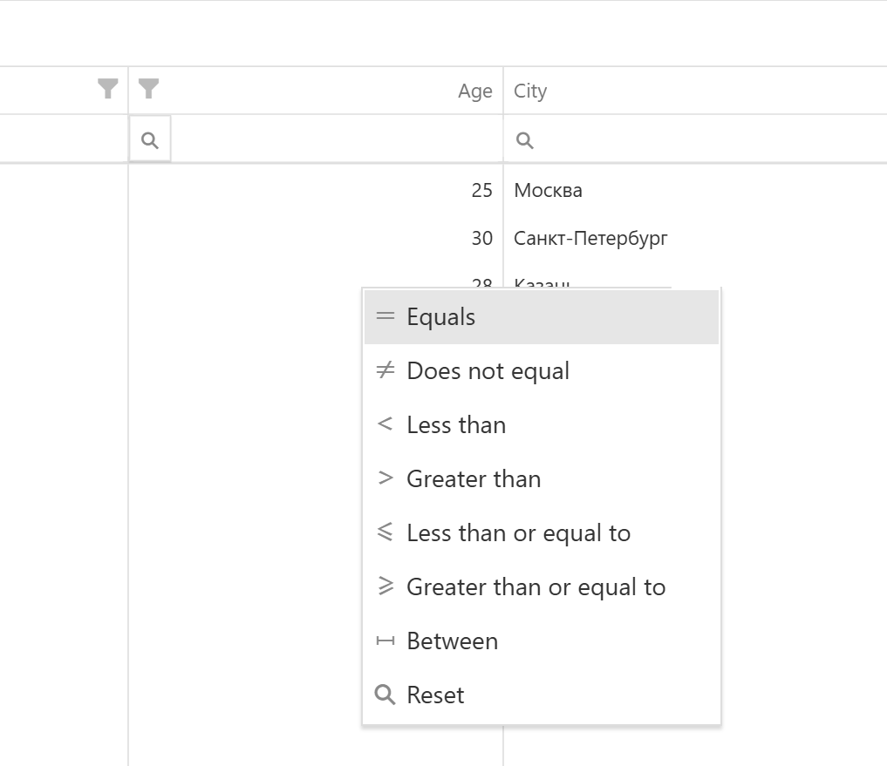

# DataGrid Widget for Visiology

Виджет-таблица на основе DevExtreme DataGrid.


**Минимально работоспособный код для запуска в Visiology.**

Смело копируйте и вставляйте в текстовый виджет - этот код запустится и покажет работающую таблицу.
Весь остальной код в репозитории - это вспомогательные функции и настройки,
которые строятся вокруг этой базовой реализации.

```javascript

// Тестовые данные
// В реальном виджете данные будут браться из w.data
const data = [
    { id: 1, name: "Иван", age: 25, city: "Москва" },
    { id: 2, name: "Мария", age: 30, city: "Санкт-Петербург" },
    { id: 3, name: "Петр", age: 28, city: "Казань" }
];

// Создание таблицы
$("#" + w.general.renderTo).dxDataGrid({
    dataSource: data,
    columns: ["id", "name", "age", "city"],
});

```


<br>
  

📚 [Официальная документация](https://js.devexpress.com/jQuery/Demos/WidgetsGallery/Demo/DataGrid/Overview/MaterialBlueLight/
) 




**Проблема фильтрации в масштабируемом окружении**

Для демонстрации проблемы с фильтрацией создан [DashboardViewport Simulator с DataGrid](https://github.com/RememberedGirl/visiology-components/blob/main/DataGrid/DashboardViewportSimulatorDataGrid.html) - откройте этот файл чтобы увидеть проблему в действии.

Что происходит:

При масштабировании дашборда всплывающие элементы фильтрации (filterRow, headerFilter) отображаются в неправильных позициях

Подсказки "застревают" в исходных координатах и не следуют за масштабированными элементами


Рекомендация: В кастомных виджетах для Visiology избегайте использования встроенных всплывающих элементов DevExtreme. 